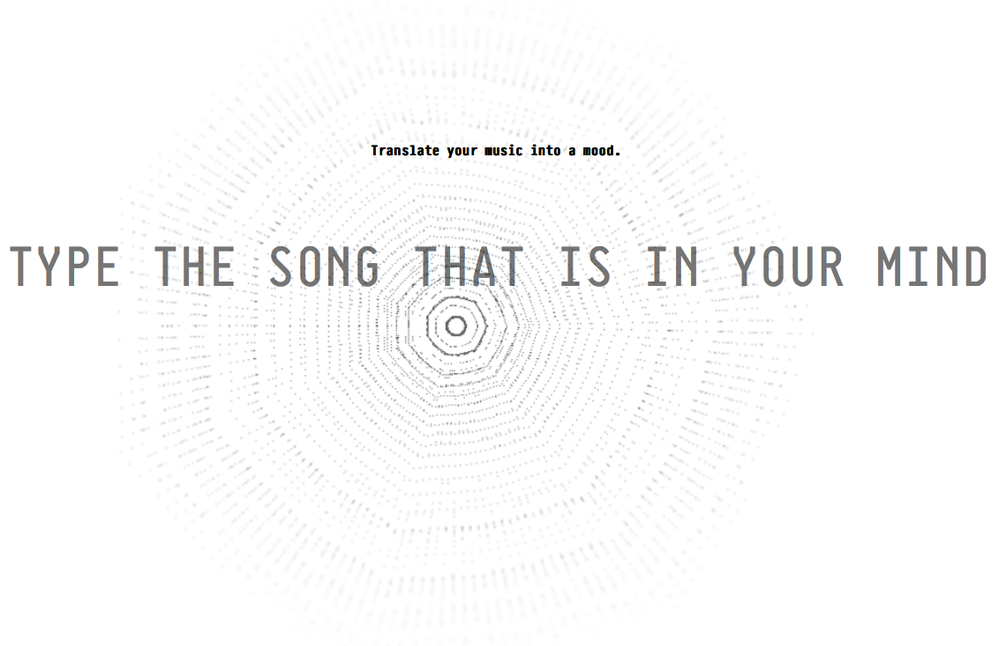

# 
# Music Mood

> How to relate your daily songs to how you feel?

We have always used several resources to identify and share our feelings. That need to share this information to feel part of something, to build connections and enter the whole.

In order to do so, we have to identify our own patterns, our day-to-day actions. How we walk, what we say, what we listen to everyday; in order to understand how we are feeling.

Whenever we make a choice, regarding music, we are creating an statement: when we choose the playlist or the artist of the day, when we listen to something anonymously or even when we decide not to listen to anything. And it is a two way street. The way we feel affects what we choose to listen and vice versa.

As in all forms of representation, we believe that when the music unveils the feeling, it is supposed to emphasize the object in matter: How do you feel? So here comes our idea of highlighting the relation between music and moods. And how to translate that into the world.

**If you are looking for our API, head to [API](#api)**

## Installing

First, you need to create a `config.json` file in the root of the `node` folder and fill with the keys and secrets.

```json
{
    "ECHONEST_API_KEY": "",
    "LASTFM_API_KEY": "",
    "LASTFM_API_SEC": ""
}
```

You can get the keys [here](http://www.last.fm/api/account/create) and [here](http://developer.echonest.com/account/register).

For development, we recomend [Vagrant](https://www.vagrantup.com/downloads.html) and [VirtualBox](https://www.virtualbox.org/wiki/Downloads).

After, go to the project folder and run:

```
~$ vagrant up
```

And wait for the machine to boot up, and run:

```
~$ vagrant ssh
```

Now, inside the machine, go to `/vagrant` (this is the project root shared folder) and run (sorry, but this may take some time, `many heavy libs`):

```
~$ cd /vagrant && sudo sh setup.sh
```

If god is with you and everything works, this will install and configure all the packages you need to run this repo. If you ran into any problem, feel free to `send a pull request` or `open an issue`. You can look the source of `setup.sh` to adapt it to your system (if you are not using `vagrant`).

If you do not run on `vagrant`, you may need to configure these lines on `node/lib/tools.js`

```javascript
if (os.hostname() === 'vagrant-ubuntu-trusty-64') {
    // localhost inside vagrant
    socket_server = 'http://localhost';
} else {
    // vagrant private IP
    socket_server = 'http://192.168.33.10';
}
```

## Running

You have three interfaces to run (as you wish):

#### The Extractor (node/extractor.js)

This is responsible for processing all song requests, extract all the data from the files and send it to the `websocket`.

Once connected to the socket, you have 2 options:

> Consume the websocket and get mood information about your current song on last.fm

Or, if you have a [hardware setup](#hardware):

> Consume the websocket and get the buffer to integrate with your hardware installation

#### The Processor (node/processor.js)

This is just an example of the websocket connection and use of the data sent over it. You can adapt as your needs. `Just a warning: it checks for a serial port, because it is hunger for LEDs :)`

#### The Web Interface (node/app.js)

This little guy will give you a web interface (as seen [here](http://musicmood.me)) to try and experiment our mood tool. To use as a real-time visualization, head to [login](http://localhost:3000/login) and create at least one account (the log will show up on `extractor.js`)

> We have some commented lines on app.js, so you can take a look at a little admin panel to manage the last.fm users (just uncomment).

So, you just need to (processor.js and app.js only if you need to):

```
~$ node node/extractor.js
```
```
~$ node node/processor.js
```
```
~$ node node/app.js
```

## API

If you just need to use the moods, and do not want to get your hands dirty, we have an API just for you.  Just make a `GET` request to (we made it `GET` to help on `crossdomain` problems):

```
GET http://api.musicmood.me/mood/{artist}/{song}/
```

Remember: {artist} and {song} need to be `URI Encoded`. Here is a sample `javascript` request using `jQuery`:

```javascript
$.ajax({
    url: "http://api.musicmood.me/mood/" + encodeURIComponent("Linkin Park") + "/" + encodeURIComponent("In The End") + "/",
    sucess: function(data) {
        console.log(data);
    }
});
```

## Hardware

Soon (how to and what we have done here at [d3.do](http://d3.do))

## TODO

- Create a TODO list

## Contributors

[Andre Biagioni](https://github.com/andrebla)

[Brenda Colautti](#)

[Carol Nishino](#)

[Jonathan Querubina](https://github.com/chr0nu5)

[Junior Magalhães](https://dribbble.com/juniormag2)

[Nathali Lima](http://twitter.com/nathiuria)
